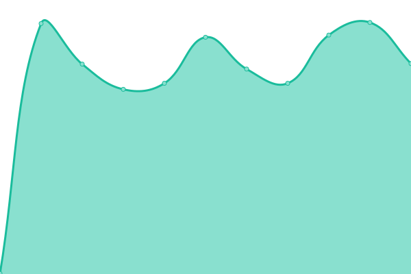
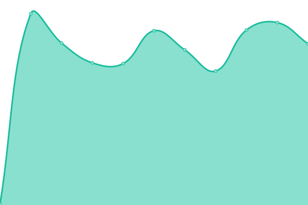

# [📈 Live Status](https://status.jeroenvd.nl): <!--live status--> **🟩 All systems operational**

This repository contains the open-source uptime monitor and status page for [appdesign1987](https://status.jeroenvd.nl), powered by [Upptime](https://github.com/upptime/upptime).

With [Upptime](https://upptime.js.org), you can get your own unlimited and free uptime monitor and status page, powered entirely by a GitHub repository. We use [Issues](https://github.com/appdesign1987/statuspage/issues) as incident reports, [Actions](https://github.com/appdesign1987/statuspage/actions) as uptime monitors, and [Pages](https://status.jeroenvd.nl) for the status page.

<!--start: status pages-->
<!-- This summary is generated by Upptime (https://github.com/upptime/upptime) -->
<!-- Do not edit this manually, your changes will be overwritten -->
<!-- prettier-ignore -->
| URL | Status | History | Response Time | Uptime |
| --- | ------ | ------- | ------------- | ------ |
|  [Hosting server](https://dagobert.jeroenvd.nl) | 🟩 Up | [hosting-server.yml](https://github.com/appdesign1987/statuspage/commits/HEAD/history/hosting-server.yml) | 

 383ms
     
 | 

<a href="https://status.jeroenvd.nl/history/hosting-server">100.00%</a>
    

|  [Hosting panel](dagobert.jeroenvd.nl) | 🟩 Up | [hosting-panel.yml](https://github.com/appdesign1987/statuspage/commits/HEAD/history/hosting-panel.yml) | 

 347ms
     
 | 

<a href="https://status.jeroenvd.nl/history/hosting-panel">100.00%</a>
    

|  [mailserver - mail ontvangen](mailcow.jeroenvd.nl) | 🟩 Up | [mailserver-mail-ontvangen.yml](https://github.com/appdesign1987/statuspage/commits/HEAD/history/mailserver-mail-ontvangen.yml) | 

 113ms
     
 | 

<a href="https://status.jeroenvd.nl/history/mailserver-mail-ontvangen">100.00%</a>
    

|  [mailserver - panel](https://mailcow.jeroenvd.nl) | 🟩 Up | [mailserver-panel.yml](https://github.com/appdesign1987/statuspage/commits/HEAD/history/mailserver-panel.yml) | 

 574ms
     
 | 

<a href="https://status.jeroenvd.nl/history/mailserver-panel">99.81%</a>
    

<!--end: status pages-->

[**Visit our status website →**](https://status.jeroenvd.nl)

## 📄 License

- Powered by: [Upptime](https://github.com/upptime/upptime)
- Code: [MIT](./LICENSE) © [Anand Chowdhary](https://anandchowdhary.com), supported by [Pabio](https://pabio.com)
- Data in the `./history` directory: [Open Database License](https://opendatacommons.org/licenses/odbl/1-0/)
